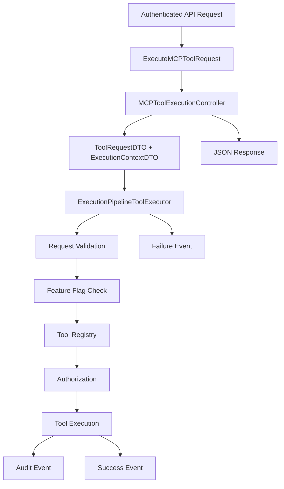

# Architecture Diagram

```mermaid
flowchart TD
    A[Authenticated API Request] --> B[ExecuteMCPToolRequest]
    B --> C[MCPToolExecutionController]
    C --> D[ToolRequestDTO + ExecutionContextDTO]
    D --> E[ExecutionPipelineToolExecutor]
    E --> F[Request Validation]
    F --> G[Feature Flag Check]
    G --> H[Tool Registry]
    H --> I[Authorization]
    I --> J[Tool Execution]
    J --> K[Audit Event]
    J --> L[Success Event]
    E --> M[Failure Event]
    C --> N[JSON Response]
```
