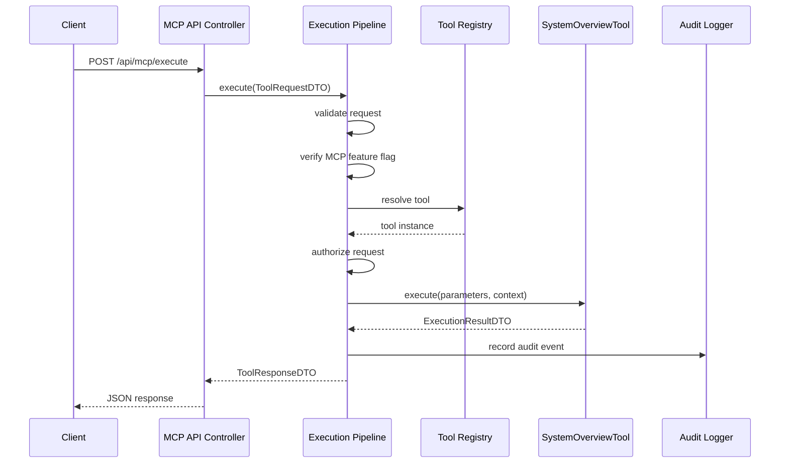

# Sequence Diagram

```mermaid
sequenceDiagram
    participant Client
    participant API as MCP API Controller
    participant Pipeline as Execution Pipeline
    participant Registry as Tool Registry
    participant Tool as SystemOverviewTool
    participant Audit as Audit Logger

    Client->>API: POST /api/mcp/execute
    API->>Pipeline: execute(ToolRequestDTO)
    Pipeline->>Pipeline: validate request
    Pipeline->>Pipeline: verify MCP feature flag
    Pipeline->>Registry: resolve tool
    Registry-->>Pipeline: tool instance
    Pipeline->>Pipeline: authorize request
    Pipeline->>Tool: execute(parameters, context)
    Tool-->>Pipeline: ExecutionResultDTO
    Pipeline->>Audit: record audit event
    Pipeline-->>API: ToolResponseDTO
    API-->>Client: JSON response
```
